# KNG — Hybrid GraphRAG over the YS Jagan Press-Meet Archive

Turn ~655 files (584 MB) of multilingual political media — Telugu-dominant, plus
English and Hindi — into a system that answers a question with a **clear,
grounded synopsis and exact source citations**, and can **trace an issue, person,
or scheme across press meets over time**.

- **Architecture:** hybrid GraphRAG = vector RAG (semantic synopsis) + a knowledge
  graph (cross-meet / temporal reasoning). Every answer cites its sources.
- **Provider-first & modular:** Sarvam powers LLM inference, ASR, OCR and
  translation; embeddings run on a local multilingual model. Swapping any
  provider is a `.env` change, not a code change.
- **Clone-and-run:** `index/` and `extracted/` are committed (~204 MB), so a
  clone is a working system — no artifact transfer, no reprocessing, and **no
  API key** for querying. Only the 584 MB `/data/` source archive stays out.
- **Scalable:** a content-hash manifest means dropping new press meets into
  `data/` only reprocesses what changed.

> Corpus is politically sensitive. The pipeline never fabricates attributions —
> answers are grounded in retrieved chunks or it says it doesn't know.

---

## Data

```
data/
  YS JAGAN_PRESSMEETS DATA/<id>_<DD.MM.YYYY>_<TOPIC>/   # ~27 dated press meets
  July 2026/<TOPIC>/                                    # topical set
```

635 files are ingestible (10 `~BROMIUM` sandbox stubs are excluded as
undecodable). Extracted: **2323 segments / 7.97M chars → 4267 chunks.**

| Type | Files | Chunks | Handling |
|------|------:|-------:|----------|
| jpeg/jpg/png | 343 | 567 | Sarvam OCR (news clips) |
| pdf | 188 | 2995 | Sarvam OCR, batched ≤10 pages; PyMuPDF fallback |
| docx/doc | 63 | 507 | authoritative transcripts |
| mp4 | 25 | 25 | Sarvam ASR — spans merged, timestamps kept |
| pptx | 13 | 167 | slide + notes text |
| xlsx | 3 | 6 | tables → markdown |

Languages by chunk: `en 2558 · te 1521 · mixed 168 · unknown 16 · hi 4`.
98% carry a date, enabling temporal filtering. One file is knowingly skipped —
an RTF in a legacy non-Unicode Telugu font (Shree-Lipi), which would index as
meaningless bytes.

---

## Architecture

KNG has two deliberately separate halves:

- The **batch data plane** reads the private archive and produces portable,
  query-ready artifacts. Extraction, embedding, and graph construction run here.
- The **serving plane** treats those artifacts as read-only input. It retrieves
  evidence, asks Sarvam to synthesize and validate an answer, and serves the
  result through the CLI or web application.

The separation means the large private `data/` tree and the cluster used to
build the index are not required on the query machine. The serving machine needs
`index/` and `extracted/`; `data/` is optional and is used only when the source
viewer should open the original binary file.

```mermaid
flowchart LR
    subgraph Batch["Batch data plane — cluster or build machine"]
        A["Operator-provided archive<br/>data/"] --> B["Discovery + path metadata<br/>content SHA-1 manifest"]
        B --> C["Multimodal extraction<br/>Sarvam OCR / ASR / cleanup"]
        C --> D["ExtractedDoc JSON<br/>extracted/"]
        D --> E["Language detection +<br/>provenance-safe chunking"]
        E --> F["Chunk JSON<br/>index/chunks/"]
        F --> G["Local bge-m3 embeddings<br/>+ LanceDB + BM25"]
        F --> H["Structural + LLM graph build<br/>NetworkX + communities"]
        G --> I["Portable index/"]
        H --> I
    end

    subgraph Serve["Serving plane — local or production server"]
        Q["Question + filters"] --> V["Vector retrieval"]
        Q --> K["BM25 retrieval"]
        Q --> L["Lexical graph entity linking"]
        V --> R["RRF + archive rerank<br/>deduplicate + diversify"]
        K --> R
        L --> X["Citable graph facts<br/>timeline + communities"]
        R --> P["Bounded evidence context"]
        X --> P
        P --> S["Local confidence floor"]
        S --> T["Sarvam evidence-sufficiency gate"]
        T --> U["Sarvam cited synthesis"]
        U --> W["Local citation syntax check"]
        W --> Y["Sarvam claim/evidence validation"]
        Y --> Z["Validated answer or<br/>explicit refusal"]
        Z --> CLI["CLI"]
        Z --> API["FastAPI + SSE + web UI"]
    end

    I --> V
    I --> K
    I --> L
```



### 1. Where the data comes from

KNG does **not** scrape websites, call a news API, or download the corpus. The
input is an operator-supplied archive copied under `data/`. Its directory names
are part of the metadata contract:

```text
data/
  YS JAGAN_PRESSMEETS DATA/
    10_28.11.2024_SECI - POWER SECTOR/
      press release.docx
      supporting order.pdf
      Sakshi clip.jpeg
      press meet.mp4
  July 2026/
    <TOPIC>/
      ...
```

`kng.pipeline.run` recursively discovers known file extensions. It ignores
Office temporary files and `~BROMIUM` micro-VM stub directories, then processes
files in stable path order. Unsupported extensions are not silently treated as
text.

For each accepted file, `kng/pipeline/metadata.py` derives:

- press-meet ID, title, date, and topic from the directory path;
- source type from the extension;
- publication, when recognizable, from names such as Sakshi, Eenadu, or Andhra
  Jyothi; and
- a project-relative source path so the finished artifacts work after copying
  the project to another machine.

Metadata extraction is intentionally conservative. If a date or publication
cannot be inferred confidently, it remains unknown instead of being guessed.

### 2. Incremental discovery and processing

`index/manifest.json` is the control plane for batch work. Each source is keyed
by its project-relative path and a SHA-1 hash of its bytes. The manifest records
the state of `extract`, `normalize`, `chunk`, `embed`, and `graph`.

On a rerun:

1. An unchanged file with a completed stage is skipped.
2. A new file is processed through the requested stages.
3. A changed hash invalidates that file's downstream stage state.
4. Progress is saved periodically, so an interrupted batch resumes instead of
   starting again.
5. Per-stage file, segment, chunk, error, and Sarvam-call counts are persisted
   in `index/stats.json`.

The graph's paid extraction cache is even finer grained: it is keyed by
normalized chunk-content hash under `index/graph/extractions/`. Duplicate
passages and already completed chunks reuse cached results, and cache files are
written atomically.

### 3. Multimodal extraction

Every source becomes one `ExtractedDoc` JSON file under `extracted/`, mirroring
the source path. An `ExtractedDoc` contains file metadata, extraction status,
Sarvam call counts, and a list of provenance-bearing `Segment` objects.

| Input | Primary production path | Offline/failure behavior | Segment locator |
|---|---|---|---|
| JPG/JPEG/PNG | Configured OCR provider; default Sarvam Document Intelligence in Telugu/Hindi/English mode | `--local-only` deliberately skips media OCR; a configured Tesseract provider can be used in a non-local-only extraction run | OCR page when present |
| PDF | Sarvam Document Intelligence over the entire document; PDFs longer than 10 pages are split into billed jobs and reassembled | PyMuPDF text-layer extraction; a scanned PDF with failed OCR and no text layer is recorded as an error | Exact 1-based page |
| DOCX | Local paragraph and table parsing, followed by content-preserving Sarvam Markdown cleanup | Raw local parse is retained if cleanup fails or appears lossy | Document segment |
| Legacy DOC/RTF-in-DOC | LibreOffice when available, otherwise RTF or OLE2 parsing, followed by optional cleanup | Unrecognized, encrypted, or legacy non-Unicode Telugu-font content is refused rather than indexed as garbage | Document segment |
| PPTX | Local slide text and speaker-note parsing, followed by optional Sarvam cleanup | Raw slide text | Exact 1-based slide |
| XLSX | Local sheet parsing to text/Markdown, followed by optional Sarvam cleanup | Raw sheet text; the current extractor reads at most 200 rows per sheet | Sheet segment |
| MP4 and other configured media extensions | `ffmpeg` converts to mono 16 kHz audio; the configured ASR provider defaults to Sarvam Saarika in 25-second windows | `--local-only` deliberately skips media ASR; faster-whisper is available as a configured provider | Exact start/end seconds |

Sarvam cleanup is formatting cleanup, not summarization. If its result is less
than half the length of the locally parsed text, KNG treats it as potentially
lossy, records that condition, and keeps the original text. A failure in one
source is attached to that source and does not terminate the batch.

Normalization detects Telugu, Devanagari/Hindi, Latin/English, mixed, or unknown
text from Unicode scripts. Optional `--translate` stores an English rendering in
`text_en`, but `text_original` is always preserved and remains the authoritative
citation evidence.

### 4. The provenance contract

Provenance is carried forward rather than reconstructed after retrieval:

```text
source file
  └─ ExtractedDoc
      └─ Segment
          ├─ press-meet ID/title/date/topic
          ├─ source type/publication/speaker/language
          ├─ original text and optional English translation
          └─ page, slide, paragraph, or video time span
              └─ Chunk
                  └─ the same flattened citation metadata
```

Pages and slides are never merged across locator boundaries. Video spans may be
merged only when consecutive ASR fragments form one continuous passage; the
result keeps the full start-to-end time range. This is what lets a returned
`[n]` open the actual file and exact page, slide, or video position.

### 5. Chunking and multilingual indexes

`kng/pipeline/chunk.py` converts segments into retrieval units:

- it uses the embedding model's tokenizer when available;
- targets roughly 1,000 tokens with 120-token overlap and a 1,400-token ceiling;
- prefers heading, paragraph, and sentence boundaries;
- never combines different PDF pages or presentation slides;
- merges short consecutive video spans into useful passages; and
- creates deterministic chunk IDs and a normalized content hash for duplicate
  suppression.

Each source gets a portable chunk file under `index/chunks/`. The embed stage
then batches those chunks through local `BAAI/bge-m3`, producing 1,024-dimensional
multilingual vectors. Sarvam is not used for embeddings.

The same chunk rows are stored in embedded LanceDB with:

- the dense vector used for cross-language semantic retrieval;
- the original passage text;
- all flattened provenance fields used for filtering; and
- a full-text index used by the BM25 keyword leg.

Embedding and upsert happen per source file. Re-indexing a changed file replaces
that file's rows instead of duplicating them. At query time KNG verifies that
the query vector dimension matches the persisted table, because silently using
a different embedding model would return plausible but incorrect neighbors.

### 6. Knowledge-graph construction

The graph is a portable NetworkX `MultiDiGraph` serialized as node-link JSON
under `index/graph/`. `config/ontology.yaml` defines valid node types, relations,
and known aliases.

Graph construction has five phases:

1. **Structural graph, local:** create PressMeet, Source, Publication, and Date
   nodes with `HAS_SOURCE`, `PUBLISHED_BY`, `HELD_ON`, and chronological
   `PRECEDES` relationships.
2. **Entity/relation extraction, paid:** send selected chunks to the configured
   LLM, normally Sarvam, using a constrained JSON schema.
3. **Resolution, local:** validate ontology types and relation endpoints, merge
   exact aliases and deterministic canonical IDs, and avoid fuzzy merges that
   could join two different people.
4. **Communities, local:** use deterministic Louvain community detection to
   identify connected issue/entity clusters.
5. **Community summaries, optional paid:** summarize sufficiently large
   communities for orientation. These summaries are never treated as citation
   evidence.

Repeated assertions of the same directed relation collapse into one weighted
edge. Each edge retains the exact chunk evidence, quote, meet, date, source
file, language, and locator that support it. The current loader also enriches
older graph artifacts from the authoritative chunk files when their serialized
evidence lacks newer provenance fields.

`--stage all` builds only the free structural graph portion. Paid graph
extraction requires an explicit `--stage graph`; `--plan-only` reports the
expected paid work without making calls.

### 7. Database and persistence design

KNG does not put every kind of data into one SQL database. Search, graph
traversal, source viewing, and application state have different access patterns,
so the project uses a small set of purpose-specific embedded stores:

| Store | Technology | Unit stored | Written when | Read when |
|---|---|---|---|---|
| Passage database | LanceDB + Apache Arrow | One row per chunk, including a 1,024-value vector | Embed stage | Every retrieval request |
| Full-text index | LanceDB FTS | Search terms over the chunk `text` column | End of embed stage | BM25 retrieval leg |
| Knowledge graph | NetworkX `MultiDiGraph`, serialized as JSON | Entity nodes, typed relation edges, evidence locators | Graph stage | Graph retrieval, paths, and timelines |
| Extracted evidence | Pydantic JSON files | One `ExtractedDoc` per raw source | Extract stage | Chunking and citation source viewer |
| Portable chunks | Pydantic JSON files | Ordered chunks for one source | Chunk stage | Embedding, graph construction, graph-evidence repair, source viewer |
| Pipeline state | JSON | Manifest, hashes, stage status, statistics | Throughout batch processing | Incremental reruns and operations |
| Application state | Local JSON and JSONL | Users, conversations, history, query telemetry | API runtime | Authentication, History, and Admin pages |

There is no database server in the default path. LanceDB is an embedded
directory, the graph is a JSON artifact loaded into memory, and the remaining
stores are files. This makes the entire query data plane portable and avoids a
Docker, PostgreSQL, or Neo4j dependency.

#### LanceDB: passage and vector database

The LanceDB table is named `chunks`. Its schema is explicit rather than inferred:

```text
vector[1024] float32
chunk_id, text, text_original, text_en, content_hash
source_file, source_type
press_meet_id, press_meet_title, date, topic
publication, speaker, language
page, slide, video_start, video_end, citation
```

The database uses one row per citable chunk. The vector is generated from the
chunk text, while every other column either contains readable evidence or
provenance. This design allows filters such as:

```text
press_meet_id = '10'
source_type = 'press_release'
language = 'te'
date >= '2024-01-01' AND date <= '2024-12-31'
```

to run against real fields. Date or meet restrictions are therefore applied
before dense ranking rather than being left for the answer model to interpret.

Dense search uses cosine distance over normalized bge-m3 vectors. The keyword
leg searches the same `text` column through LanceDB's full-text index. Both legs
return the complete row, including the citation fields, so retrieval never needs
to join an untraceable vector back to its source.

Updates are idempotent at source-file level:

1. Delete the existing rows whose `source_file` matches the changed file.
2. Add the newly generated rows for that file.
3. Rebuild/refresh the full-text index at the end of embedding.
4. Mark that source's embed stage complete in the manifest.

At query time the configured embedding model produces one question vector. KNG
checks its length against the table's persisted vector dimension before search.
A mismatch raises an explicit deployment error instead of silently falling back
to weaker keyword results.

#### NetworkX: graph database

The graph store models relationships that are awkward to answer from nearest
passages alone:

```text
Person ──MAKES_CLAIM──> Issue
PressMeet ──MENTIONS──> Person
PressMeet ──HELD_ON──> Date
PressMeet ──PRECEDES──> PressMeet
Source ──PUBLISHED_BY──> Publication
```

It is a directed multigraph: two nodes can have several different relation
types, while repeated observations of the same relation increase that edge's
weight. Node IDs are deterministic functions of the ontology type and canonical
name, so rebuilding does not generate a new random identity for the same entity.

Content-bearing edges store evidence rather than only a relationship label:

```text
relation, weight, first_date, last_date, press_meet_ids
evidence[]:
  chunk_id, quote, citation, source_file
  press_meet_id, date, source_type, publication, language
  page, slide, video_start, video_end
```

The graph is saved to `index/graph/graph.json` using NetworkX node-link JSON.
Communities are stored separately in `communities.json`. During serving, the
graph is loaded once into process memory and cached using the file's modification
time and size. Replacing the graph file causes a later load to receive the new
artifact rather than querying stale in-memory state.

Graph lookup is not a vector search. It first performs conservative lexical
entity linking over canonical names and aliases, then traverses one or more
edges. This intentionally avoids an embedding model incorrectly merging or
linking similar political names. If an older graph evidence record contains a
chunk ID but lacks a newer locator field, KNG joins it to the authoritative
`index/chunks/` record in memory. Unknown chunk IDs remain unresolved; they are
never assigned a guessed source.

NetworkX is the production default because the current graph fits in memory and
the JSON travels with the index. A Neo4j export/configuration path exists for a
future server-backed graph, but the current retrieval architecture does not
require Neo4j.

#### JSON evidence and operational stores

The JSON layers are not redundant copies of LanceDB:

- `extracted/` preserves the source-level extraction result and original
  segmentation. It is the closest portable representation of the raw archive.
- `index/chunks/` is the authoritative bridge between retrieval rows, graph
  evidence, and the source viewer.
- `index/manifest.json` answers “does this file need this stage?” and is never
  used as answer evidence.
- `index/stats.json` reports cumulative and per-run counts; it is operational
  telemetry, not retrieval content.
- `index/graph/extractions/` preserves paid structured LLM output so graph builds
  can resume without paying for the same content again.
- `var/` contains deployment-specific accounts and user activity and is never
  exported with the corpus index.

Application JSON writes use temporary files followed by atomic replacement
where overwriting would otherwise risk corruption. This state model is
appropriate for the current small, single-process deployment. For multiple API
workers or hosts, accounts/history should move to a transactional database such
as PostgreSQL, and shared quotas/session coordination should move to Redis.
LanceDB and the graph can remain read-only replicated artifacts.

#### Which database is read for one question?

```text
question
  ├─> LanceDB vector index ──> semantically similar chunks
  ├─> LanceDB full-text index ──> exact keyword/number matches
  └─> NetworkX graph ──> linked entities, evidence edges, timeline
            │
            └─> index/chunks JSON when an edge needs its full text/locator

merged evidence
  └─> Sarvam inference
        └─> cited source request
              └─> index/chunks + extracted JSON
                    └─> optional original file under data/
```

Chat history is written only after an answer attempt. It is not searched as RAG
evidence and is not mixed into the archive databases.

### 8. Query and retrieval flow

One question produces a `Context` with independent passage and graph evidence:

1. Input filters are compiled into LanceDB predicates for language, source type,
   press-meet ID, publication, and date range.
2. The **vector leg** embeds the question with the same bge-m3 model and retrieves
   cross-lingual semantic neighbors.
3. The **keyword leg** performs BM25 search over the same filtered chunk table,
   recovering exact names, acronyms, amounts, and scheme titles.
4. Reciprocal Rank Fusion combines the two ranked lists without comparing
   incomparable raw vector and BM25 scores.
5. A deterministic archive-aware reranker applies bounded query-term and source
   priors. Attribution questions favor direct press releases/video/news
   evidence; documentary questions favor supporting source documents.
6. Byte-equivalent passages are collapsed by content hash, and results are
   diversified so one large file does not monopolize the answer context.
7. The **graph leg** lexically links question n-grams against graph names and
   curated aliases. It retrieves the linked entities' neighborhoods, citable
   facts, communities, and—when the question is temporal—their meet timeline.
8. Graph evidence is filtered at the individual locator level. An aggregated
   cross-meet edge cannot leak evidence from a meet, publication, type, or date
   outside the caller's requested scope.

The default final passage count is `k=12`. Retrieval is fully local and makes no
Sarvam call.

### 9. Inference: where and how models are used

In KNG, **inference** means running a learned model on input. Reading LanceDB,
matching a graph alias, applying a date filter, Reciprocal Rank Fusion, and
checking citation numbers are deterministic operations; they are not LLM
inference.

Inference happens in two different lifecycles:

| Lifecycle | Model/provider | Input | Output | Network/cost |
|---|---|---|---|---|
| Extraction | Sarvam Vision, by default | Image or PDF | Page-ordered OCR Markdown | Paid remote call/job |
| Extraction | Saarika ASR, by default | 25-second audio window | Transcript with start/end time | Paid remote call |
| Extraction | Sarvam chat model | Locally parsed office text | Content-preserving cleaned Markdown | Paid remote call |
| Normalization, optional | Mayura | Telugu/Hindi/mixed segment | `text_en` translation | Paid remote call |
| Indexing | Local bge-m3 | Every passage chunk | Normalized 1,024-dimensional embedding | Local compute, no API |
| Graph build | Sarvam chat model | Selected chunk + metadata + ontology schema | Typed entities and relations | Paid remote call, cached |
| Graph build, optional | Sarvam chat model | Entity/relation community | Orientation summary | Paid remote call |
| Query retrieval | Local bge-m3 | User question | One query embedding | Local compute, no API |
| Answer gate | Sarvam chat model | Question + bounded retrieved evidence | `sufficient` or `insufficient` JSON | One logical call; retry is possible |
| Answer synthesis | Sarvam chat model | Question + numbered sources + language instruction | Cited synopsis | One streamed call; a broken stream is not restarted |
| Grounding gate | Sarvam chat model | Each answer claim + only its cited evidence | `supported` or unsupported-claim JSON | One logical call; retry is possible |

All model construction goes through `kng/providers/`. Configuration chooses the
provider and model without putting a provider client inside pipeline, retrieval,
or API code. The production defaults are:

```text
Chat/structured inference: Sarvam sarvam-105b
OCR:                       Sarvam sarvam-vision
ASR:                       Sarvam saarika:v2.5
Translation:               Sarvam mayura:v1
Passage/query embeddings:  local BAAI/bge-m3 on CPU
```

Sarvam does not provide the embeddings used here. Passage and question
embeddings must come from the same configured model; changing only the query
model invalidates vector retrieval even if its output dimension happens to be
the same.

#### Build-time inference

Build-time inference converts unstructured media into reusable artifacts:

1. OCR/ASR turns images, PDFs, and recordings into original-language segments.
2. Office cleanup restructures locally extracted text without translating or
   summarizing it.
3. Local bge-m3 embeds every final chunk once.
4. Structured graph inference asks Sarvam for ontology-constrained entities and
   relations. The request contains chunk text plus meet/date/speaker/publication
   metadata.
5. Returned JSON is validated locally. Unknown types, malformed entities, and
   relations with missing endpoints are dropped and counted.
6. The accepted result is cached by chunk-content hash before it is resolved
   into graph nodes and edges.

Graph inference is never run implicitly by `--stage all`; the paid pass requires
an explicit graph command. Provider calls use bounded concurrency, rate
limiting, retry accounting, exponential backoff, and atomic cache checkpoints.
A bad chunk stays visible as failed work and does not stop the corpus batch.

#### Online answer inference

After local retrieval has assembled evidence, answer generation is a bounded,
fail-closed pipeline:

1. Passage results and graph evidence are converted into a single numbered
   source namespace. Only sources actually placed in the prompt may be cited.
2. Prompt input is capped at 12 passages, 8 graph facts, and approximately
   14,000 source characters. Graph quotes can promote their exact underlying
   chunks into the prompt, which helps an English question reach Telugu direct
   evidence.
3. A conservative local confidence score rejects obvious off-topic retrieval
   before a paid call.
4. Sarvam judges whether the supplied evidence is sufficient to answer the
   question. Insufficient or malformed validation produces a refusal.
5. Sarvam writes the synopsis in the requested language, using only the numbered
   sources and attributing allegations or political claims to their speaker or
   publication.
6. A local validator removes nonexistent citation numbers and rejects every
   factual sentence without a valid citation.
7. A separate Sarvam validation call compares every generated claim with only
   the evidence cited for that claim. Unsupported claims, validator failure, or
   an empty result replace the entire answer with an explicit refusal.

A successful validated answer therefore uses three logical inference calls:
**sufficiency → synthesis → claim validation**. Retrieval-only mode uses none.
The provider-request count can be higher if a structured validation call retries
after a transient error. Provider text is buffered until all checks pass, so the
web client never sees an unsupported partial answer that is later withdrawn.

Question text and archive passages are marked as untrusted prompt data. The
generator and validators are instructed not to follow embedded instructions or
reveal prompts, configuration, or credentials.

The three online calls have deliberately different responsibilities:

- The **sufficiency judge** decides whether an answer is possible. It is not
  allowed to add knowledge and returns structured JSON.
- The **synthesizer** writes the answer from the prompt-visible source namespace.
  It receives the desired answer language and uses low temperature.
- The **claim judge** does not review the answer against the whole archive. For
  each sentence it receives only that sentence and the sources cited by it,
  making unsupported actors, numbers, dates, negations, and attributions easier
  to detect.

If any gate times out, returns malformed output, rejects the evidence, or finds
an unsupported claim, KNG returns a refusal. It does not expose an unvalidated
partial completion or silently downgrade to an uncited answer.

The web application's conversation history is persistence, not model context.
Each `/api/ask` call currently retrieves and answers the submitted question on
its own; earlier turns are stored for reopening in the UI but are not
automatically inserted into the next inference prompt. A follow-up such as “what
about the next year?” must therefore include enough subject context in the new
question.

For offline development, `KNG_FAKE_LLM=1` replaces remote chat inference with a
deterministic fixture. It tests retrieval, prompt construction, validation,
streaming, and citations, but its prose is visibly labeled and must not be
treated as a real archive answer.

### 10. API, UI, and source resolution

`kng/api/main.py` exposes the serving plane through FastAPI:

- signed, HTTP-only session cookies and scrypt password hashes;
- revocable sessions, roles, disabled accounts, and login throttling;
- bounded request fields, `k`, graph hops, filters, and question length;
- per-account paid-request quotas and a concurrent-answer semaphore;
- `/api/health` for liveness and `/api/ready` for artifact/config readiness;
- Server-Sent Events in the order `meta → sources → validated delta → final`;
- per-user searchable conversation history; and
- an admin query log with latency, citation, grounding, and refusal metrics.

When the UI opens a citation, `kng/api/sources.py` resolves the requested chunk
against `index/chunks/`, then reads the matching `ExtractedDoc` segment. Invalid
chunk IDs or pages return 404 instead of falling back to the first passage. If
the private `data/` archive is present, the API can also report the original
file as available; portable query deployments remain functional without it.

Application state lives under git-ignored `var/`:

```text
var/
  users.json
  history/<user-id>/<session-id>.json
  queries.jsonl
```

The built-in quota and concurrency state are process-local. A multi-worker or
multi-host production deployment should put global rate limits in Redis or an
API gateway and terminate TLS at a reverse proxy.

### 11. Artifact and deployment boundary

| Path | Produced by | Used for |
|---|---|---|
| `data/` | Operator-supplied private archive | Batch extraction and optional original-file viewing |
| `extracted/<source>.json` | Extraction + normalization | Authoritative extracted text and source viewer |
| `index/manifest.json` | Every batch stage | Incremental per-file/per-stage state |
| `index/stats.json` | Every batch stage | Persisted processing and provider-call counts |
| `index/chunks/<source>.json` | Chunk stage | Portable passages and exact locators |
| `index/lancedb/` | Embed stage | Dense-vector and BM25 retrieval |
| `index/graph/extractions/` | Paid graph extraction | Resumable content-hash LLM cache |
| `index/graph/graph.json` | Graph build | Entities, relations, evidence, and timelines |
| `index/graph/communities.json` | Graph build | Community membership and optional summaries |
| `var/` | API runtime | Accounts, history, and query telemetry |

The intended production flow is:

1. Run extraction, chunking, embedding, and graph construction on the cluster.
2. Export an allow-listed archive containing `index/`, `extracted/`, and the
   ontology.
3. Verify the SHA-256 sidecar and `EXPORT.json` metadata, including embedding
   dimension/model compatibility.
4. Copy the archive to the serving host.
5. Install query/API dependencies, configure a Sarvam key and session secret,
   and run the readiness check before accepting traffic.

The export never includes `.env`, API keys, `var/` user data, or the private raw
corpus.

---

## Setup

### Querying an existing index (no API key needed)

The committed `index/` + `extracted/` make a fresh clone immediately queryable:

```bash
git clone <repo> KNG && cd KNG
uv venv --python 3.11 .venv && source .venv/bin/activate
uv pip install -e '.[local]'   # bge-m3 + torch (~2GB), for query-side embedding
cp .env.example .env           # SARVAM_API_KEY only needed to re-run the pipeline

python -m kng.stats            # per-stage document counts
python -m kng.graph_query stats
python -m kng.query "Tirupati laddu" -k 5
```

The first query downloads the bge-m3 model from HuggingFace (~2 GB, free). After
that everything runs offline.

### Re-running the pipeline

Needs the `/data/` source archive (not in git) and a `SARVAM_API_KEY`:

```bash
uv pip install -e .            # core (extraction + vector store)
uv pip install -e '.[cloud]'   # optional providers (anthropic/cohere/neo4j)
uv pip install -e '.[api]'     # FastAPI backend
```

`.[local]` is not optional: Sarvam has no embeddings API, so the index is built
by a local model (`LOCAL_EMBED_MODEL`, default `BAAI/bge-m3`, 1024-dim).

Requires `ffmpeg` on PATH (audio extraction for ASR). LibreOffice (`soffice`) is
used for legacy `.doc` when present, but both RTF and OLE2 `.doc` have
pure-Python fallbacks, so it is not required.

---

## Usage

```bash
# 1. Ingest (incremental — safe to re-run; only new/changed files are processed)
python -m kng.pipeline.run --stage all           # extract → normalize → chunk → embed → graph
python -m kng.pipeline.run --stage chunk         # or run one stage
python -m kng.pipeline.run --only "10_28.11.2024*"  # limit to matching press meet(s)
python -m kng.stats                              # per-stage document counts

# 2. Search the index — ranked passages with exact citations (WP2)
python -m kng.query "Tirupati laddu ghee adulteration"
python -m kng.query "ఏపీ మద్యం కుంభకోణం" -k 5
python -m kng.query "liquor scam" --lang te --since 2025-01-01   # metadata prefilters

# 3. Ask a question — grounded synopsis with [n] citations (WP4)
python -m kng.answer "What did Jagan say about the Tirupati laddu adulteration?"
python -m kng.answer "SECI solar tariff" -k 12 --since 2024-01-01
python -m kng.answer "TTD laddu" --retrieval-only        # free: the evidence, no LLM call
KNG_FAKE_LLM=1 python -m kng.answer "TTD laddu"          # free: whole path, offline fixture

# 4. Serve the chat web app — PressMeets RAG (WP5)
pip install -e '.[api]'
python -m kng.api.users add --email you@example.com --admin   # prompts for password
KNG_SESSION_SECRET=$(openssl rand -hex 32) \
  uvicorn kng.api.main:app --host 127.0.0.1 --port 8000       # http://localhost:8000
KNG_FAKE_LLM=1 KNG_SESSION_SECRET=… uvicorn kng.api.main:app  # free, offline UI work
#    pages: /  chat · /history  search & reopen past answers · /admin  accounts + usage
python -m kng.api.users role   --email them@example.com --role admin
python -m kng.api.users delete --email them@example.com --yes  # + their history

# 5. Score retrieval against a fixed question set — free, no key (WP6)
python -m kng.eval                          # 30 questions: hit rate, MRR, per-script cuts
python -m kng.eval -k 12 --baseline docs/eval/baseline-2026-07-26-k8.json  # production
python -m kng.eval -k 30 --baseline docs/eval/baseline-2026-07-26-k8.json   # deltas
KNG_FAKE_LLM=1 python -m kng.eval --answer  # answer path too, offline and free

# 6. Export the portable index for your other system (WP6)
python -m kng.pipeline.export --plan                    # inventory + sizes
python -m kng.pipeline.export --out kng-index.tar.gz    # archive + .sha256
python -m kng.pipeline.export --verify kng-index.tar.gz # checksum + EXPORT.json record
```

`kng.query` is retrieval only — it returns the evidence and where it came from.
`kng.answer` adds the graph leg and writes the cited synopsis. Retrieval is free
and local. A successful production answer uses three logical Sarvam inference
calls: evidence sufficiency, synthesis, and independent claim/citation
validation. A structured gate may retry after a transient provider error, so
the provider-request counter can be higher; an early refusal normally stops
after the sufficiency gate. `--retrieval-only` shows the exact prompt-visible
evidence before anything is spent. Unsupported or uncited output is replaced by
an explicit refusal and is never streamed provisionally.

**Extraction is already complete on this checkout**; re-running `--stage extract`
costs paid Sarvam calls. `--stage chunk`/`embed`/`query` are free and local.

**Recovering the index without re-paying:** `--rebuild-manifest` reconstructs
lost incremental state from `extracted/`; `--repair-extracted` re-cleans the
extracted docs in place.

---

## Layout

```
kng/
  config.py            # typed settings from .env
  models.py            # Segment / ExtractedDoc / Chunk (provenance-first)
  providers/           # swappable model backends
    sarvam.py  llm.py  embeddings.py  ocr.py  asr.py  translate.py
  pipeline/
    manifest.py        # content-hash incremental state
    metadata.py        # derive meet id/date/topic/publication from paths
    extract/           # docx pdf pptx xlsx image(OCR) video(ASR)
    normalize.py chunk.py embed.py run.py export.py
    graph_build.py       # WP3 phases A (structural, free) + D (communities)
    graph_extract.py     # WP3 phases B/C/E — the paid ones
  graph/  ontology.py    # reads config/ontology.yaml; constrains + validates
  query.py               # vector retrieval smoke test (WP2)
  graph_query.py         # graph smoke test (WP3): neighbors/path/timeline
  answer.py              # WP4 CLI: hybrid retrieval → cited synopsis
  store/                 # vector.py (LanceDB) · graph.py (NetworkX/Neo4j)
  retrieval/             # WP4: hybrid.py (vector+BM25+RRF) · graph_context.py
  generation/            # WP4: synthesize.py (grounded prompt + citation check)
  api/                   # WP5: main.py auth.py users.py meta.py sources.py history.py
    static/              #      index/login/history/admin html + app/history/admin js
  eval/                  # WP6: questions.yaml + harness.py (retrieval & answer scoring)
tests/                   # python -m unittest discover -s tests  (140 tests)
var/                     # WP5 app state: users, history, query log (git-ignored)
config/  ontology.yaml            # graph node/edge types + alias table
docs/                            # WORK_PACKAGES.md + handovers/
index/                           # portable output — copy this to the query machine
  manifest.json  stats.json  chunks/  lancedb/  graph/
```

---

## Work packages

Built in independently-resumable work packages; each ends with a handover doc in
[`docs/handovers/`](docs/handovers/). See [docs/WORK_PACKAGES.md](docs/WORK_PACKAGES.md).

| WP | Scope | Status |
|----|-------|--------|
| WP0 | Foundation: scaffold, config, data model, manifest, providers | ✅ done |
| WP1 | Multimodal extraction + Sarvam OCR/ASR + normalization | ✅ text done · OCR/ASR ready |
| WP1b | Sarvam-first universal extraction + per-stage doc counts | ✅ done · 634/635 files · 2323 seg |
| WP2 | Chunk → embed → LanceDB (RAG works) | ✅ done · 4267 chunks · bge-m3 (1024d) |
| WP3 | Knowledge graph build | ✅ done · 8120 nodes / 10773 edges / 1157 communities · full corpus, all 33 meets |
| WP4 | GraphRAG query engine (cited synopsis) | ✅ done · hybrid RRF + graph leg · 34 tests · warm 0.22 s/query |
| WP5 | FastAPI + chat web UI (**PressMeets RAG**) | ✅ done · auth (sessions revocable) · validated SSE answers · clickable exact citations · History · admin |
| WP6 | Eval, hardening, portable export | 🚧 production local rerank + k=12: **hit 0.800 / MRR 0.536** · fail-closed Sarvam validation · 140 tests |

> **Resume point:** WP6 continued — add passage-level gold labels and fix temporal
> retrieval, then A/B a learned multilingual reranker against the shipped local
> stage. The current system resolves all 13,567 graph evidence records, refuses
> unsupported output, and measured 0.800 hit / 0.536 MRR at the production k=12.
> `python -m kng.pipeline.export` produces a 66.8 MB portable archive.
